# System Design Diagrams – SAST Security Copilot

---

## 4.1 System Architecture Diagram

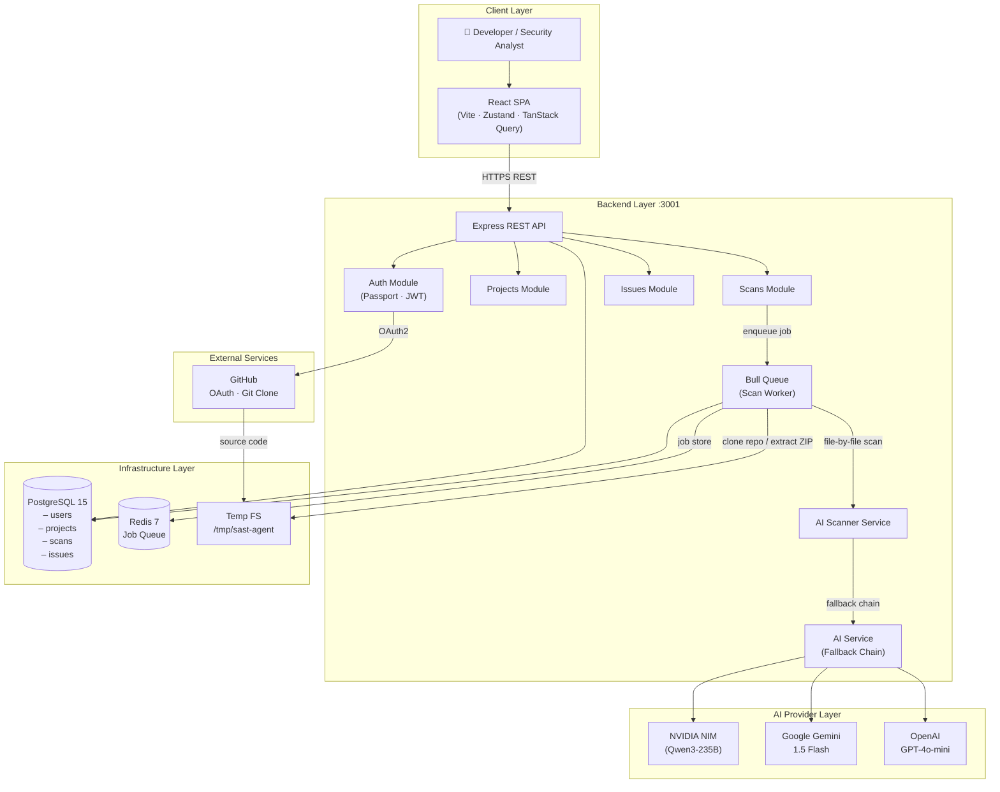

---

## 4.2 Data Flow Diagram – Level 0 (Context)

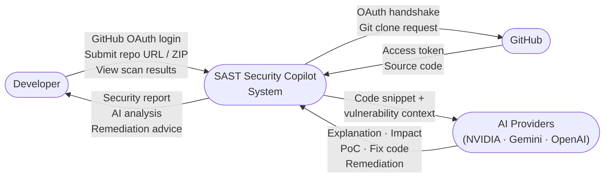

---

## 4.3 Data Flow Diagram – Level 1

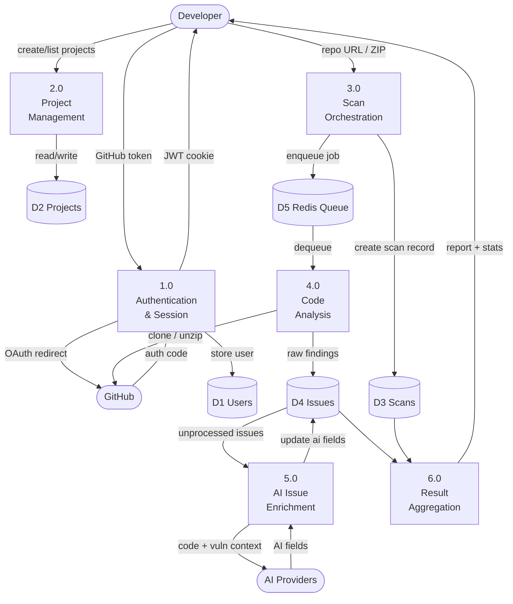

---

## 4.4 Use Case Diagram

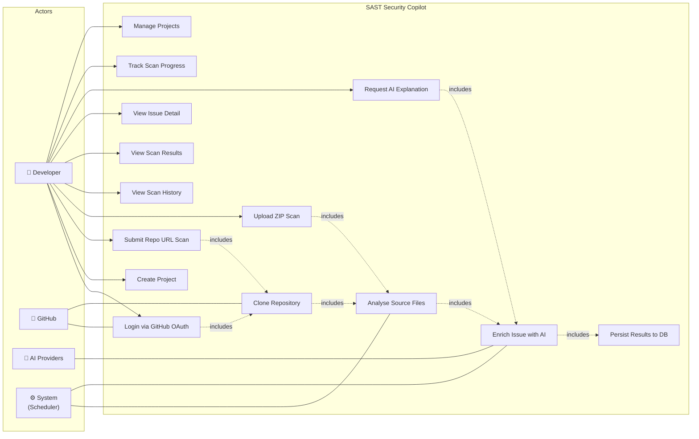

---

## 4.5 Activity Diagram

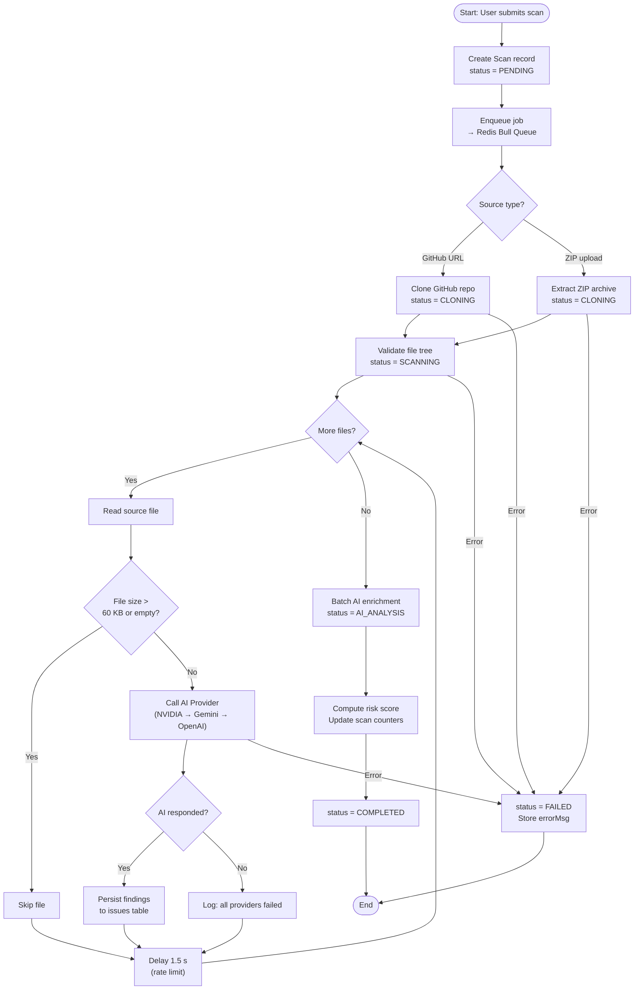

---

## 4.6 Class Diagram

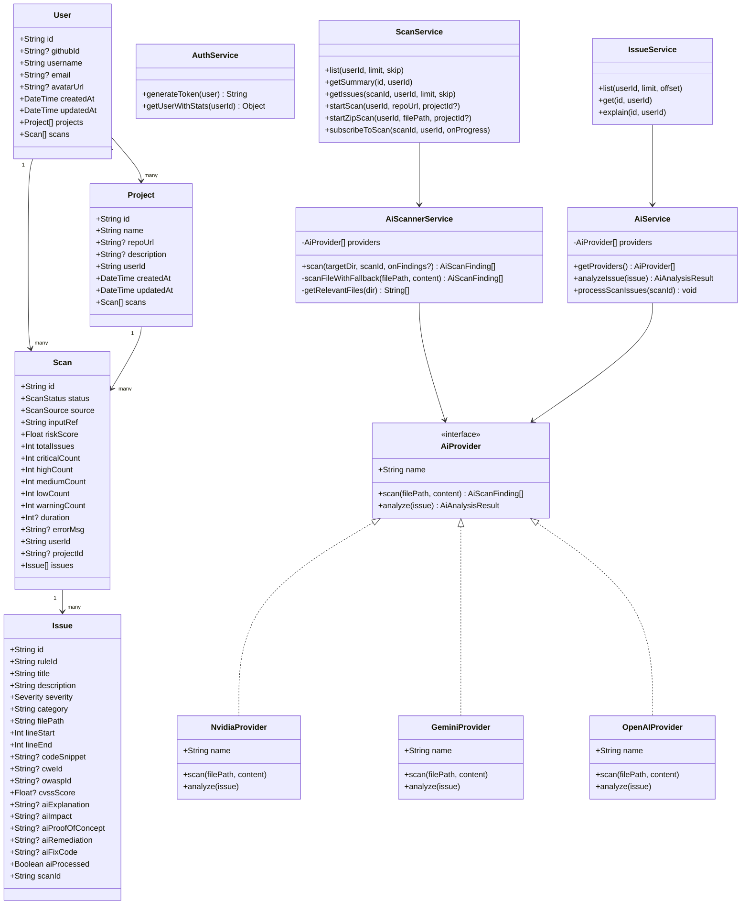

---

## 4.7 Sequence Diagram

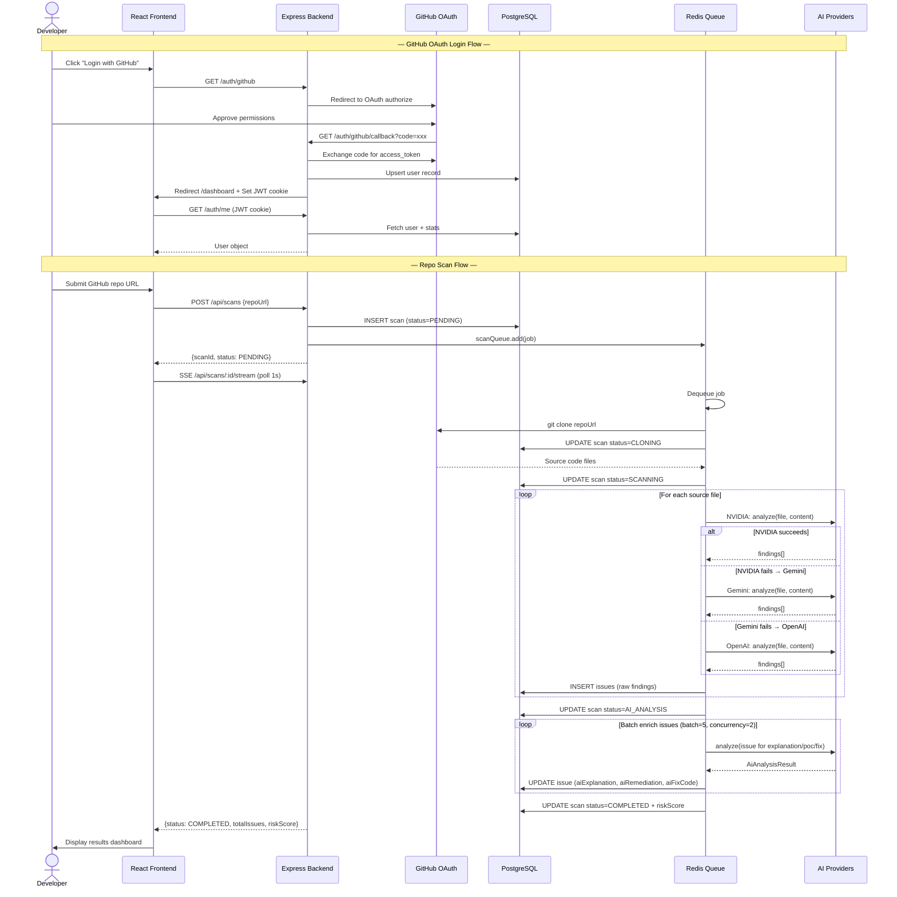

---

## 4.8 Collaboration Diagram

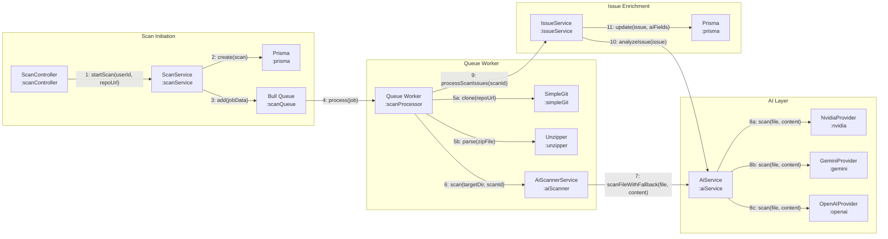

---

## 4.9 Component Diagram

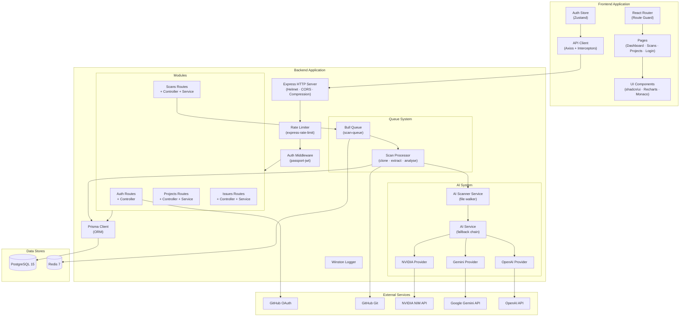

---

## 4.10 Deployment Diagram

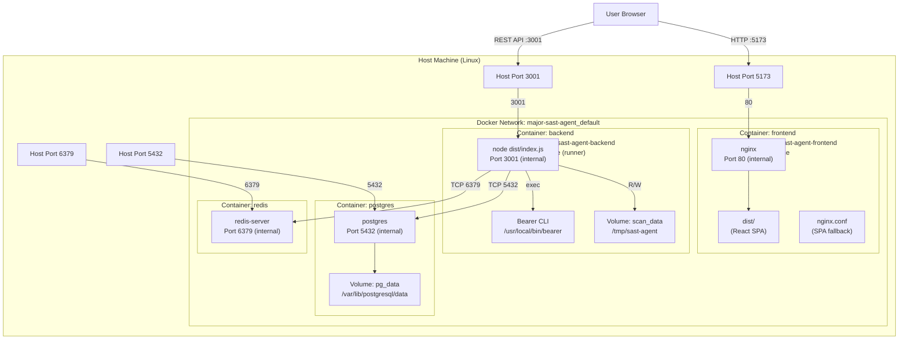

---

## 4.11 State Chart Diagram

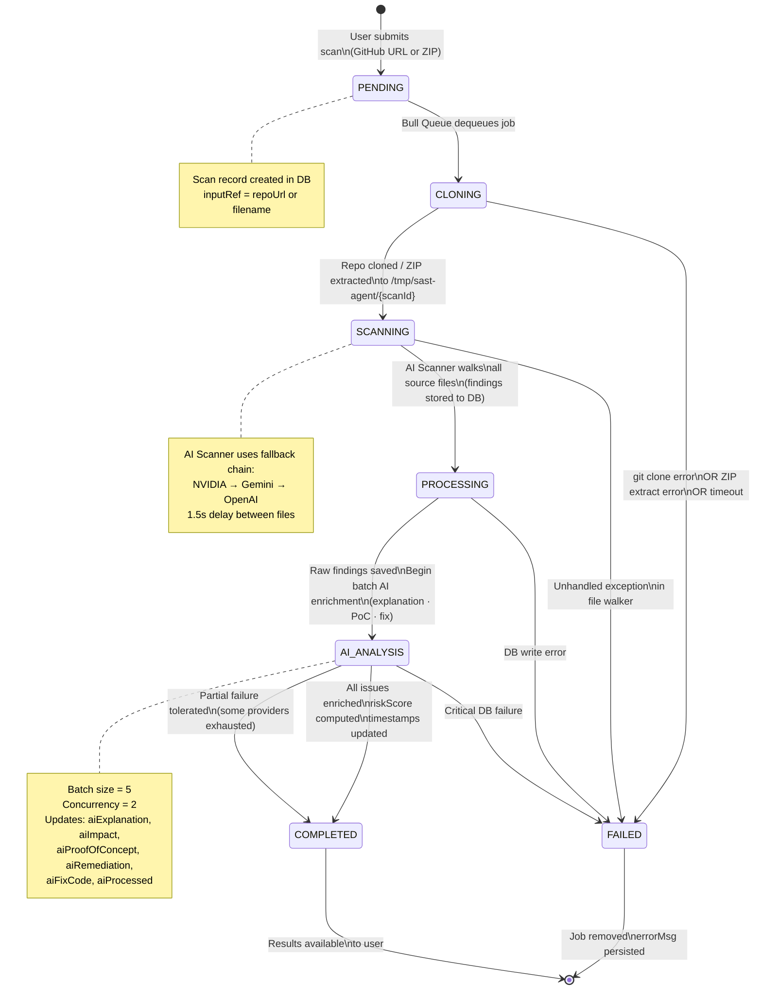
